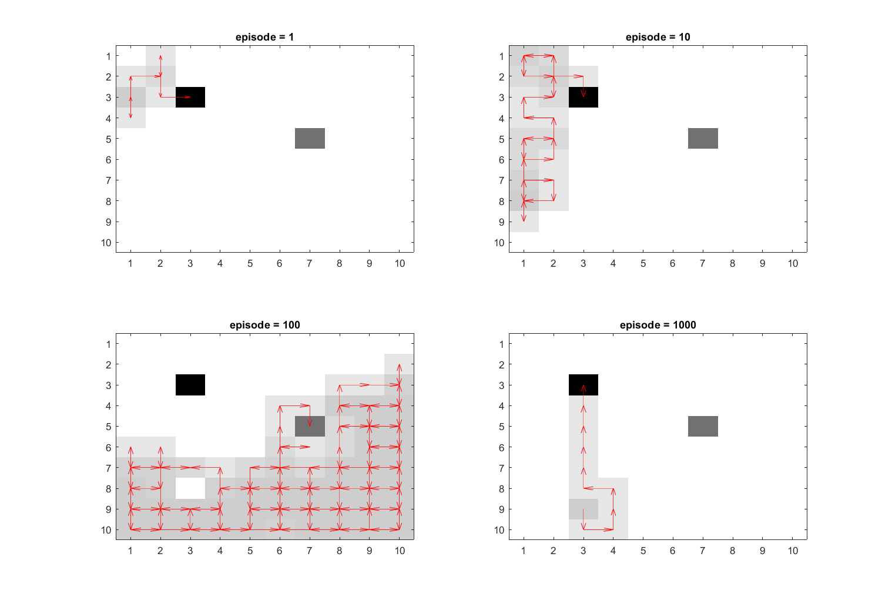
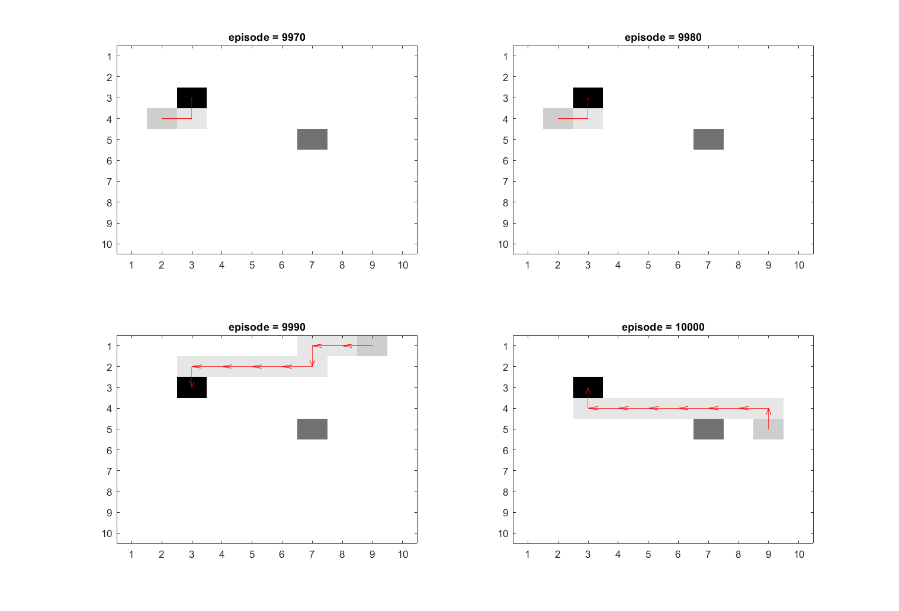

# Homework 5

<!--
To see [extra-report](https://github.com/MohammadRaziei/advanced-neuroscience-course/raw/master/HW05/extra-report.pdf) for explanatory information about this howework, click bellow button.

<a type="button" class="btn btn-primary" href="https://github.com/MohammadRaziei/advanced-neuroscience-course/tree/master/HW05/extra-report.pdf"> extra-report.pdf </a>
-->

## Part A and B: TD(0)

For some comparative reasons, I showed results for bellow conditions.

##### For &beta;=2 and &epsilon;=0.1

<figure>
    
    <figcaption>Fig : number of steps (<b>&beta;=2</b>, <b>&epsilon;=0.05</b>, &gamma;=0.95, &lambda;=0.8)</figcaption>
</figure>

<figure>
    
    <figcaption>Fig : optimal path ratio  (<b>&beta;=2</b>, <b>&epsilon;=0.1</b>, &gamma;=0.95, &lambda;=0.8)</figcaption>
</figure>

<figure>
    
    <figcaption>Fig : optimal path differance (<b>&beta;=2</b>, <b>&epsilon;=0.1</b>, &gamma;=0.95, &lambda;=0.8)</figcaption>
</figure>
<figure>
    
    <figcaption>Fig : agent path of episodes 1, 10, 100, 1000  (<b>&beta;=2</b>, <b>&epsilon;=0.1</b>, &gamma;=0.95, &lambda;=0.8)</figcaption>
</figure>

<figure>
    
    <figcaption>Fig : agent path of episodes 9970, 9980, 9990, 10000  (<b>&beta;=2</b>, <b>&epsilon;=0.1</b>, &gamma;=0.95, &lambda;=0.8)</figcaption>
</figure>

<figure>
    
    <figcaption>Fig : value-map of episodes 1, 10, 100, 1000  (<b>&beta;=2</b>, <b>&epsilon;=0.1</b>, &gamma;=0.95, &lambda;=0.8)</figcaption>
</figure>

<figure>
    
    <figcaption>Fig : value-map of episodes 9970, 9980, 9990, 10000  (<b>&beta;=2</b>, <b>&epsilon;=0.1</b>, &gamma;=0.95, &lambda;=0.8)</figcaption>
</figure>

<video controls autoplay width=80% >
    <source src="results/partAB_pathSimulated_beta2_eps0.1_gamma0.95_lambda0.8.mp4" type="video/mp4">
    [VIDEO] (Your browser does not support the video tag.)
</video>

---

##### For &beta;=2 and &epsilon;=0.05

<figure>
    
    <figcaption>Fig : number of steps (<b>&beta;=2</b>, <b>&epsilon;=0.05</b>, &gamma;=0.95, &lambda;=0.8)</figcaption>
</figure>

<figure>
    
    <figcaption>Fig : optimal path ratio  (<b>&beta;=2</b>, <b>&epsilon;=0.05</b>, &gamma;=0.95, &lambda;=0.8)</figcaption>
</figure>

<figure>
    
    <figcaption>Fig : optimal path differance (<b>&beta;=2</b>, <b>&epsilon;=0.05</b>, &gamma;=0.95, &lambda;=0.8)</figcaption>
</figure>
<figure>
    
    <figcaption>Fig : agent path of episodes 1, 10, 100, 1000  (<b>&beta;=2</b>, <b>&epsilon;=0.05</b>, &gamma;=0.95, &lambda;=0.8)</figcaption>
</figure>

<figure>
    
    <figcaption>Fig : agent path of episodes 9970, 9980, 9990, 10000  (<b>&beta;=2</b>, <b>&epsilon;=0.05</b>, &gamma;=0.95, &lambda;=0.8)</figcaption>
</figure>

<figure>
    
    <figcaption>Fig : value-map of episodes 1, 10, 100, 1000  (<b>&beta;=2</b>, <b>&epsilon;=0.05</b>, &gamma;=0.95, &lambda;=0.8)</figcaption>
</figure>

<figure>
    
    <figcaption>Fig : value-map of episodes 9970, 9980, 9990, 10000  (<b>&beta;=2</b>, <b>&epsilon;=0.05</b>, &gamma;=0.95, &lambda;=0.8)</figcaption>
</figure>

<video controls autoplay width=80% >
    <source src="results/partAB_pathSimulated_beta2_eps0.05_gamma0.95_lambda0.8.mp4" type="video/mp4">
    [VIDEO] (Your browser does not support the video tag.)
</video>

---

##### For &beta;=15 and &epsilon;=0.1

<figure>
    
    <figcaption>Fig : number of steps (<b>&beta;=15</b>, <b>&epsilon;=0.1</b>, &gamma;=0.95, &lambda;=0.8)</figcaption>
</figure>

<figure>
    
    <figcaption>Fig : optimal path ratio  (<b>&beta;=15</b>, <b>&epsilon;=0.1</b>, &gamma;=0.95, &lambda;=0.8)</figcaption>
</figure>

<figure>
    
    <figcaption>Fig : optimal path differance (<b>&beta;=15</b>, <b>&epsilon;=0.1</b>, &gamma;=0.95, &lambda;=0.8)</figcaption>
</figure>
<figure>
    
    <figcaption>Fig : agent path of episodes 1, 10, 100, 1000  (<b>&beta;=15</b>, <b>&epsilon;=0.1</b>, &gamma;=0.95, &lambda;=0.8)</figcaption>
</figure>

<figure>
    
    <figcaption>Fig : agent path of episodes 9970, 9980, 9990, 10000  (<b>&beta;=15</b>, <b>&epsilon;=0.1</b>, &gamma;=0.95, &lambda;=0.8)</figcaption>
</figure>

<figure>
    
    <figcaption>Fig : value-map of episodes 1, 10, 100, 1000  (<b>&beta;=15</b>, <b>&epsilon;=0.1</b>, &gamma;=0.95, &lambda;=0.8)</figcaption>
</figure>

<figure>
    
    <figcaption>Fig : value-map of episodes 9970, 9980, 9990, 10000  (<b>&beta;=15</b>, <b>&epsilon;=0.1</b>, &gamma;=0.95, &lambda;=0.8)</figcaption>
</figure>

<video controls autoplay width=80% >
    <source src="results/partAB_pathSimulated_beta15_eps0.1_gamma0.95_lambda0.8.mp4" type="video/mp4">
    [VIDEO] (Your browser does not support the video tag.)
</video>

---

You can find more figures (that are changed their parameters) by clicking bellow button.

<a type="button" class="btn btn-default" href="https://github.com/MohammadRaziei/advanced-neuroscience-course/tree/master/HW06/results"> See more figures </a>

