# Plasticity STDP

# Part A:

In the initial step I create one train of poisson spikes. shown here: 

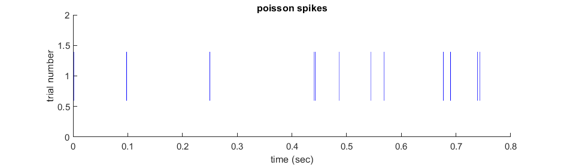

and calculate its `ISI` histogram, fano-factor, Cv:

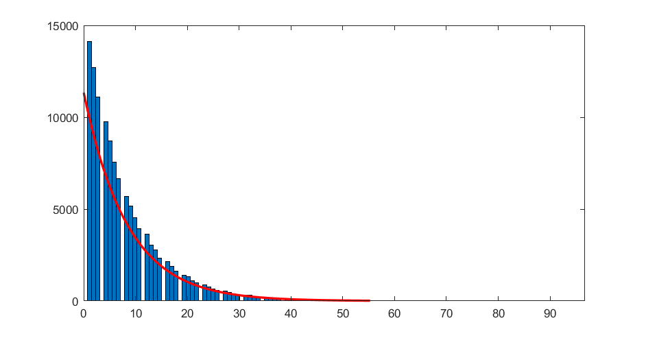

|key | value|
|:----------- |:-------|
| Fano-Factor | 0.91033 |
| Cv  |0.93536|

I wrote `stdp_curve` function to calculate synaptic changes.

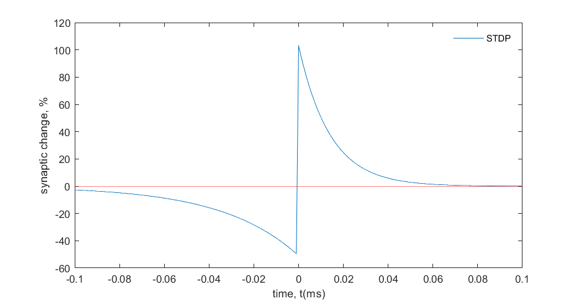

then I illustrate all-to-all scenario for desired results after averaging 30 trails of solution.

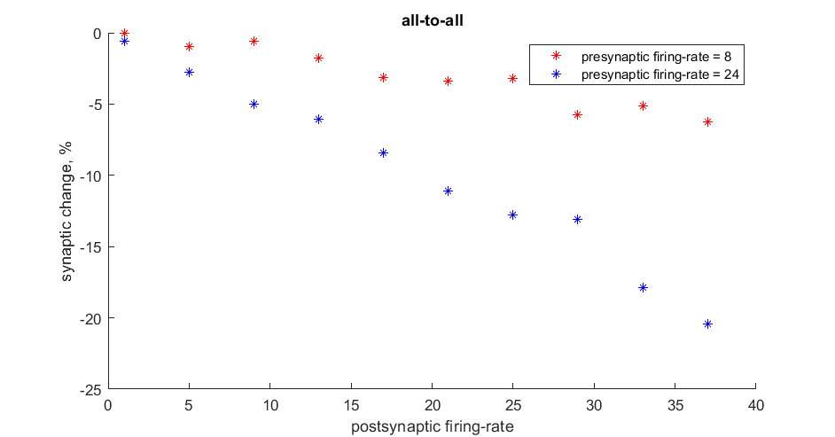

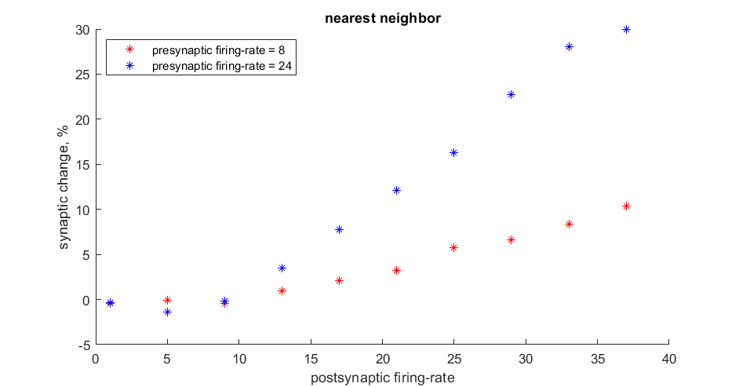

now I changed `tau_n` and observed that it change in low values of postsynaptic firing-rate.

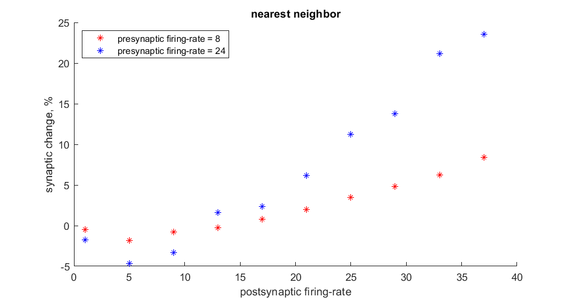

## Part B:

I chose following parameters:

| Number of excitatory | Number of inhibitory | Vth | Vr | Ve | Vi | Vsp | C |
|:-----:|:-----:|:-----:|:-----:|:-----:|:-----:|:-----:|:-----:|
| 19 | 11 | -50 mv | -70 mv | 0 mv| 80 mv | -30 mv| 30e-3 |

* Without updating __Wi__ in time 
  

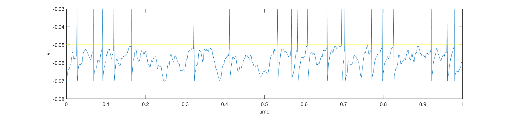

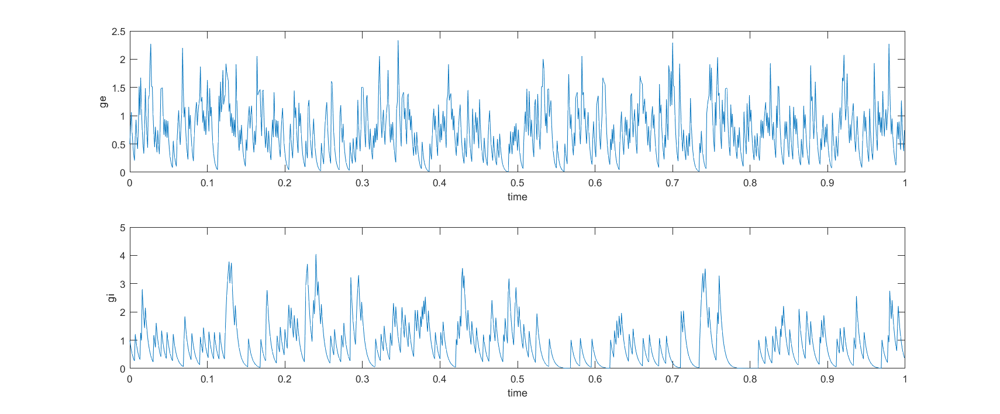

* Just updating __Wi__ for the first presynaptic neuron

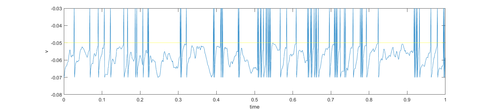

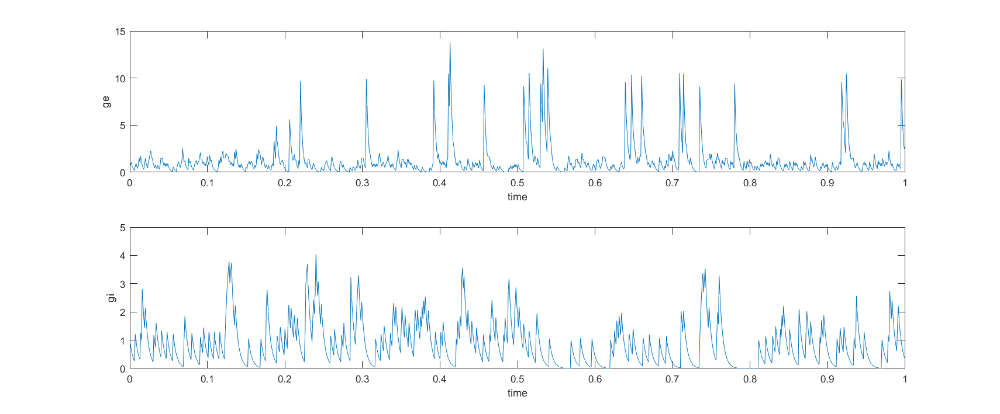

* Updating __Wi__ for all presynaptic neurons

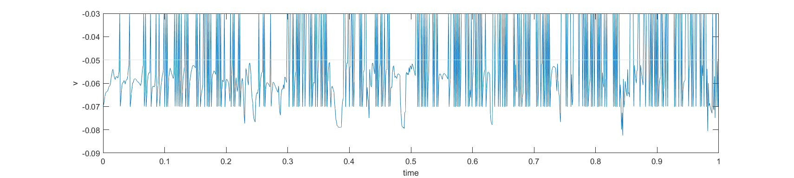

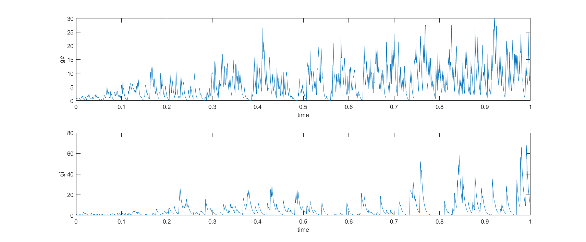

* In the case which updating __Wi__ for the first presynaptic neuron, we have following graph

  > I changed inhibitory presynaptic neurons' firing-rate to change postsynaptic firing-rate randomly by multiplying their firing-rates into a parameter named `alpha` changed from 0.8 to 4.

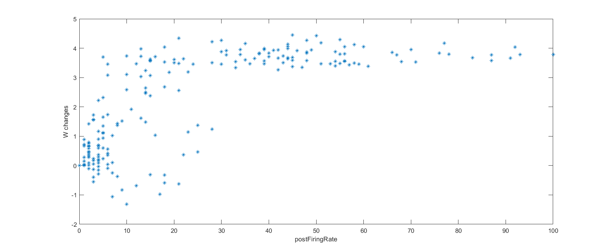

According to above figure, we can see some kind of saturation when postsynaptic firing-rate is increased. we can also see in low firing-rate a sagittal curve.  

## Part C:

At the first step, I created 1000 paired firing-rate as pre and post synaptic one.  in this case I used `mvnrnd` matlab command to generate following paired data.

#### Hebb Rule

I set its average on (0,0), then used Hebb Rule. because of instability of this rule we cannot use following formulas. 

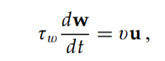

So according to [the paper](http://www.gatsby.ucl.ac.uk/~lmate/biblio/dayanabbott.pdf), I replaced that with auto-correlation form.

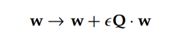

Where Q is :

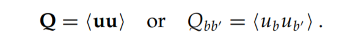

we can observe that __w__ stretches along maximum covariance direction. we notice that if mu is equal to zero, covariance and auto-correlation matrix has the same meaning.

I also illustrated the first principal component that show the maximum covariance direction. so both of them referred to the same thing.

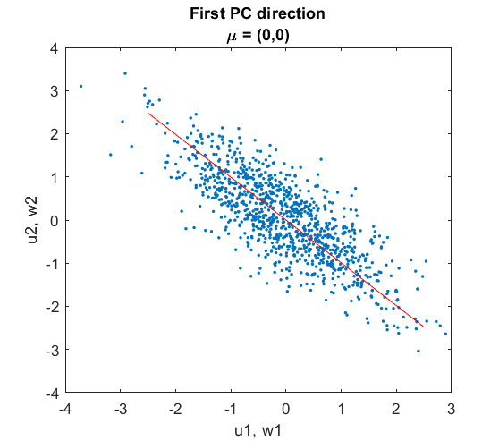

In the next step, I turned its average into (2,2). we can observe that it's been changed.

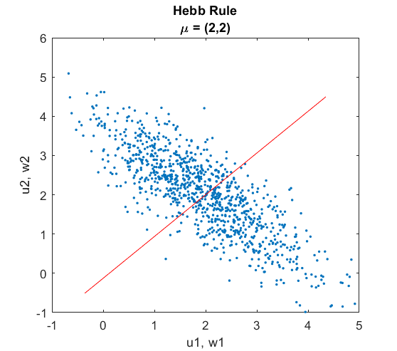

#### Covariance Rule

Similar to previous step we must change formulas to get more stability. so I assigned `Q = cov(u)` in matlab. that's because we chose average of __u__ as &theta; (the threshold parameter).

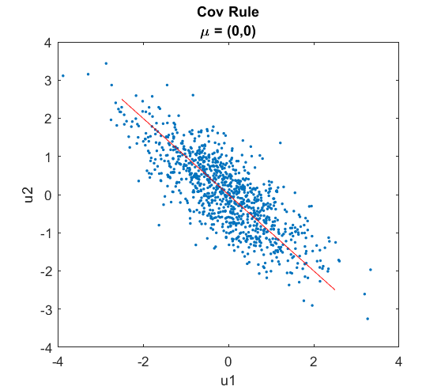

we can observe it not sensitive of changing its average.

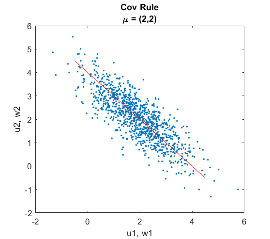

#### BCM Rule

There is extra formulas to implement in this section:

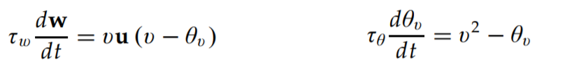

And the results is like bellow:

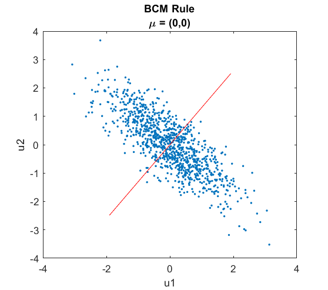

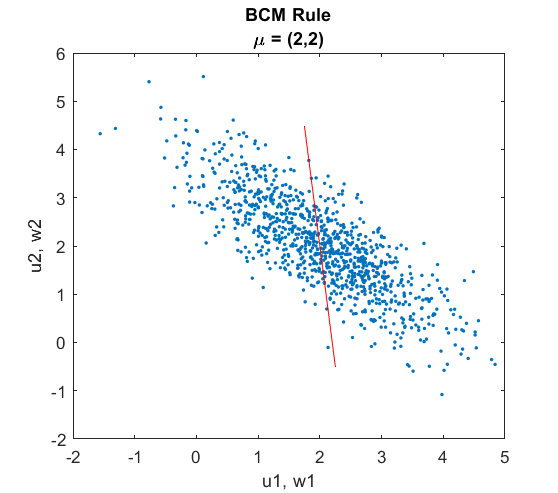

