# Homework 4

## Part A

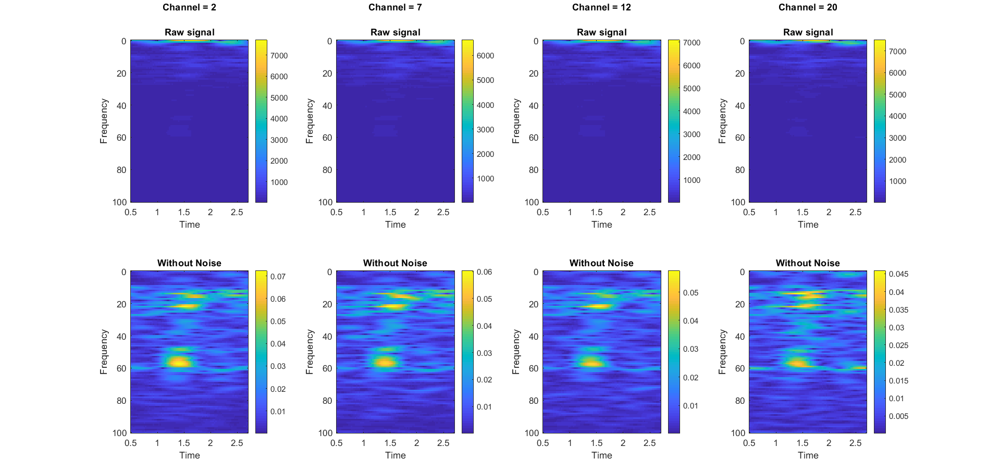
        
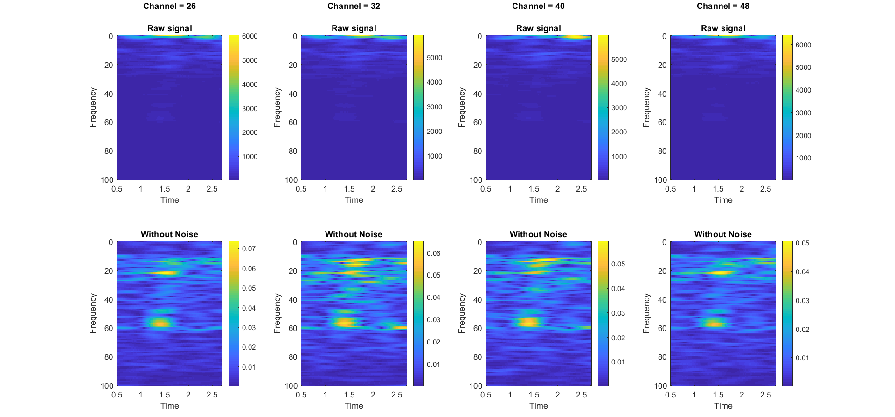
        
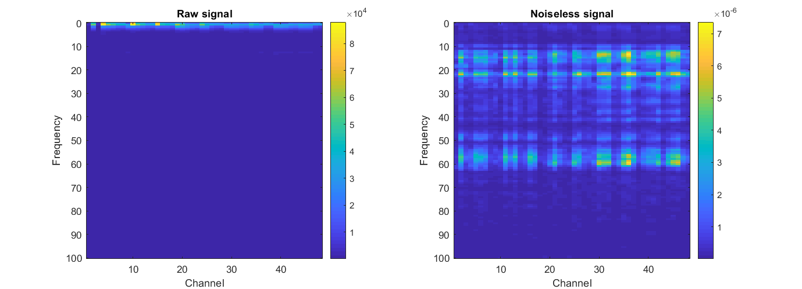

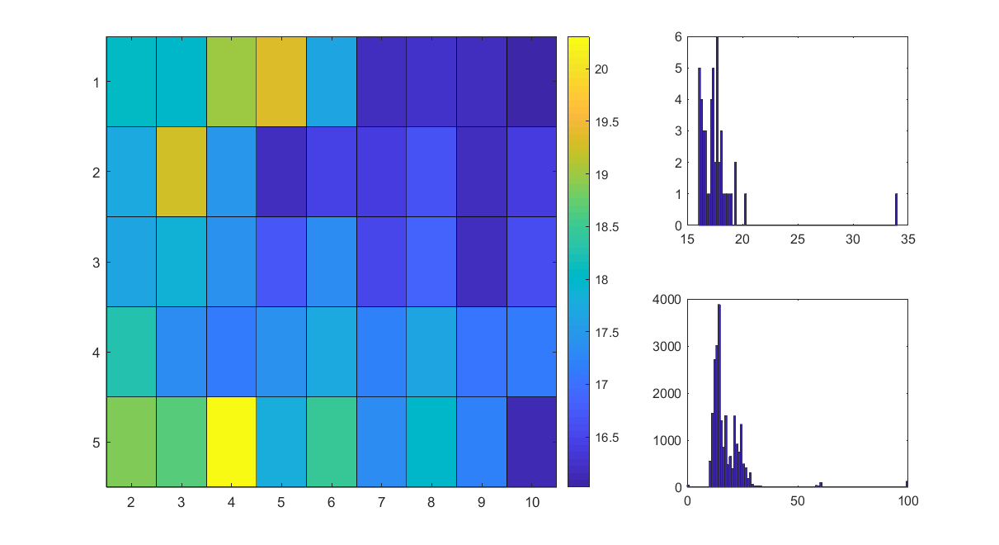

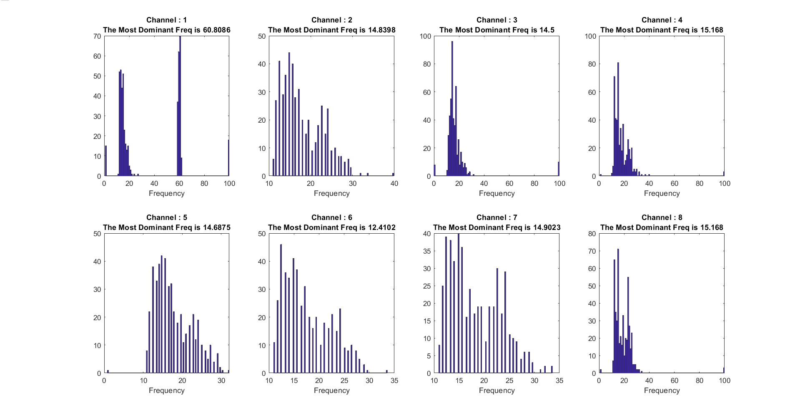

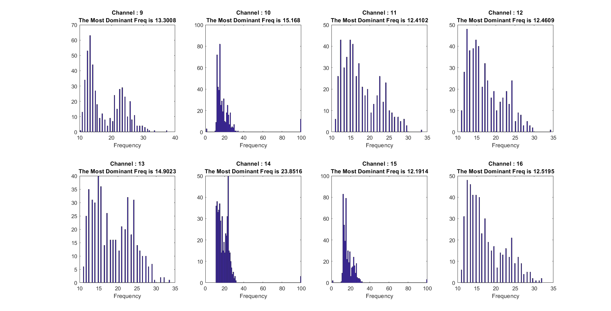

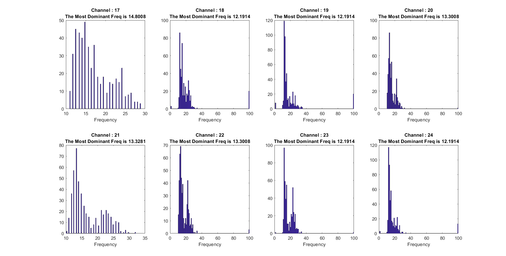

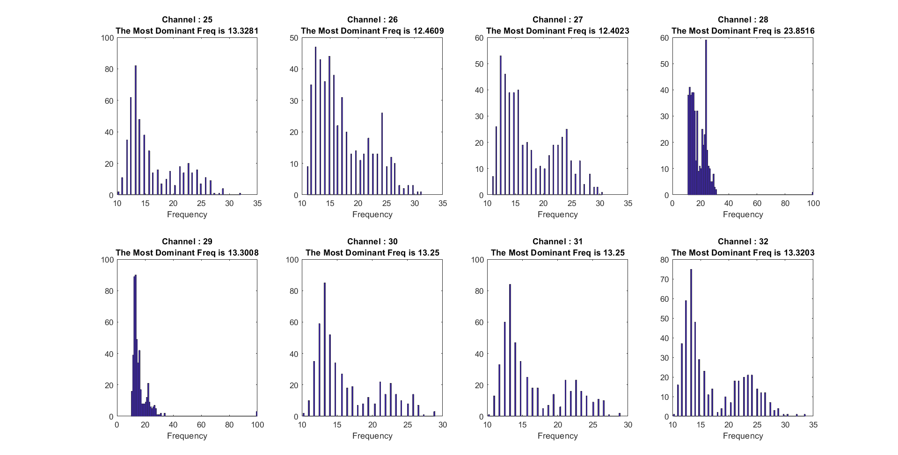

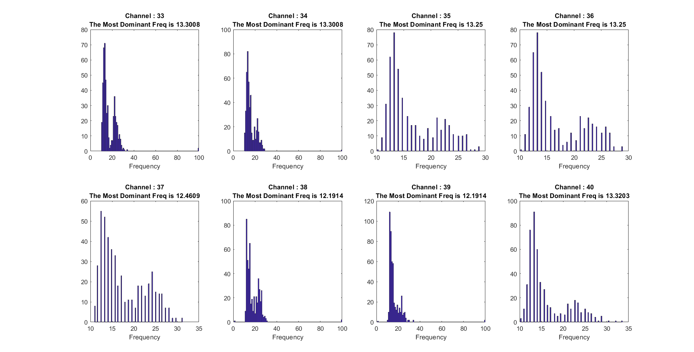

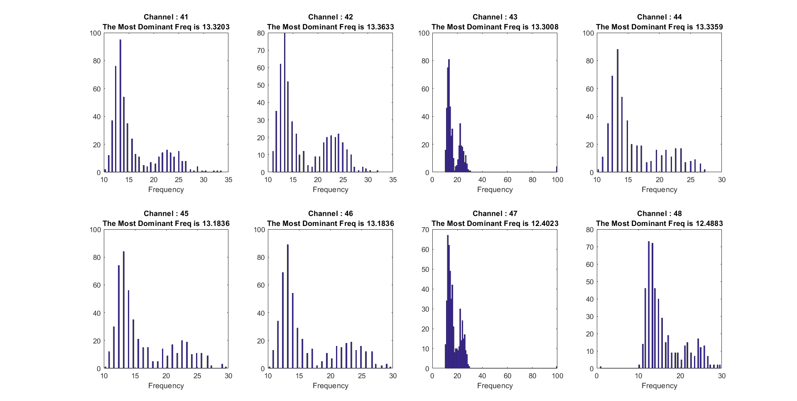

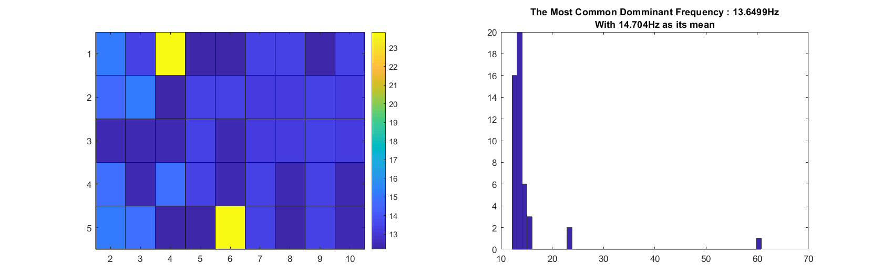

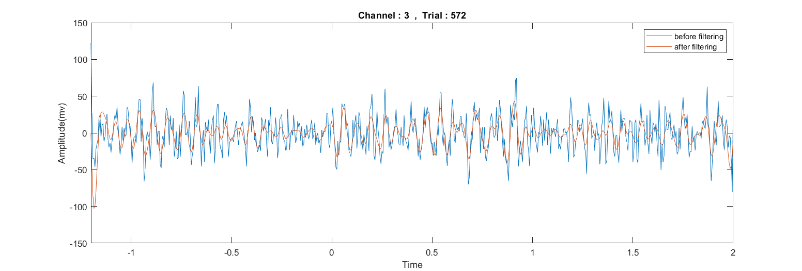
<!--

-->

## Part B

<video controls autoplay width=80% >
    <source src="movie-1.mp4" type="video/mp4">
Your browser does not support the video tag.
</video>

## Code
For this homework, I prepared a [Github repository](https://github.com/MohammadRaziei/advanced-neuroscience-course) to developing all about this.

<a type="button" class="btn btn-default" href="https://github.com/MohammadRaziei/advanced-neuroscience-course/tree/master/HW04"> Go to the project </a>

