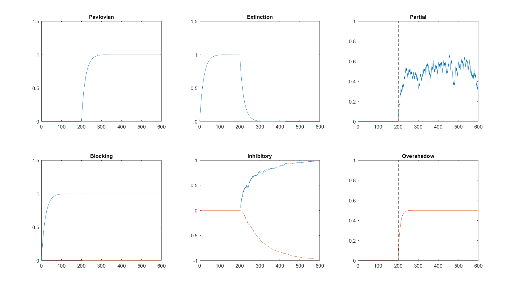
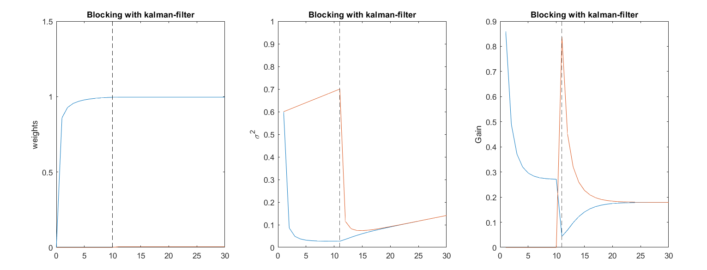
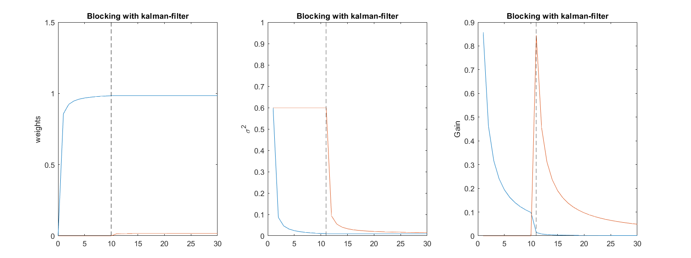
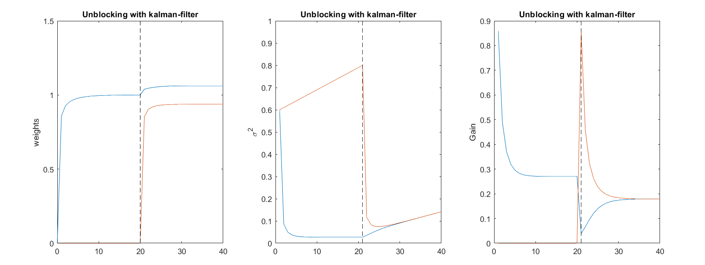
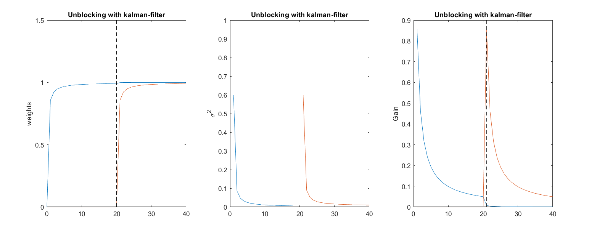
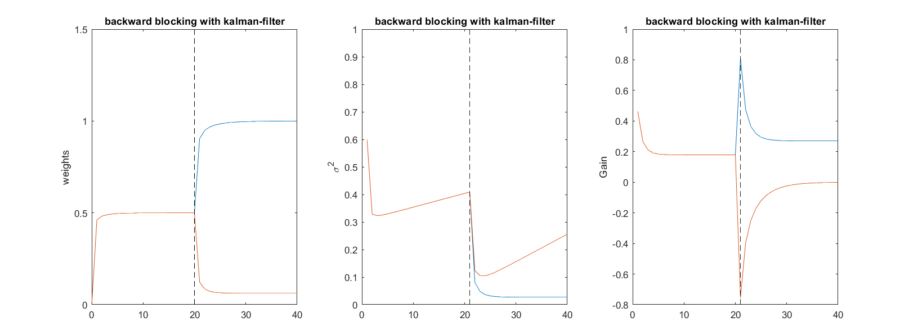
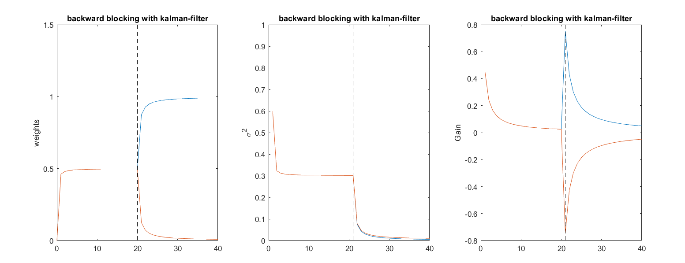

# Homework 5

## Part A: RW rule

<figure>
    
    <figcaption>Fig 1: RW-rule for above paradigms</figcaption>
</figure>

---

## Part B: Uncertainty and Learning  

<figure>
    
    <figcaption>Fig 2: Blocking implimented by kalman-filter and also using &sigma;02 = 0.01 in &Sigma; defenition</figcaption>
</figure>

<video controls autoplay width=80% >
    <source src="Blocking-0.01.mp4" type="video/mp4">
    [VIDEO] (Your browser does not support the video tag.)
</video>

---

<figure>
    
    <figcaption>Fig 3: Blocking implimented by kalman-filter and also using &sigma;02 = 0 in &Sigma; defenition</figcaption>
</figure>

<video controls autoplay width=80% >
    <source src="Blocking-0.mp4" type="video/mp4">
    [VIDEO] (Your browser does not support the video tag.)
</video>

---

<figure>
    
    <figcaption>Fig 4: Unblocking implimented by kalman-filter and also using &sigma;02 = 0.01 in &Sigma; defenition</figcaption>
</figure>

<video controls autoplay width=80% >
    <source src="Unblocking-0.01.mp4" type="video/mp4">
    [VIDEO] (Your browser does not support the video tag.)
</video>

---

<figure>
    
    <figcaption>Fig 5: Unblocking implimented by kalman-filter and also using &sigma;02 = 0 in &Sigma; defenition </figcaption>
</figure>

<video controls autoplay width=80% >
    <source src="Unblocking-0.mp4" type="video/mp4">
    [VIDEO] (Your browser does not support the video tag.)
</video>

---

<figure>
    
    <figcaption>Fig 6: Backward-blocking implimented by kalman-filter and also using &sigma;02 = 0.01 in &Sigma; defenition </figcaption>
</figure>

<video controls autoplay width=80% >
    <source src="backward blocking-0.01.mp4" type="video/mp4">
    [VIDEO] (Your browser does not support the video tag.)
</video>

---

<figure>
    
    <figcaption>Fig 7: Backward-blocking implimented by kalman-filter and also using &sigma;02 = 0 in &Sigma; defenition</figcaption>
</figure>

<video controls autoplay width=80% >
    <source src="backward blocking-0.mp4" type="video/mp4">
    [VIDEO] (Your browser does not support the video tag.)
</video>

## Code
For this homework, I prepared a [Github repository](https://github.com/MohammadRaziei/advanced-neuroscience-course) to developing all about this.

<a type="button" class="btn btn-default" href="https://github.com/MohammadRaziei/advanced-neuroscience-course/tree/master/HW05"> Go to the project </a>

