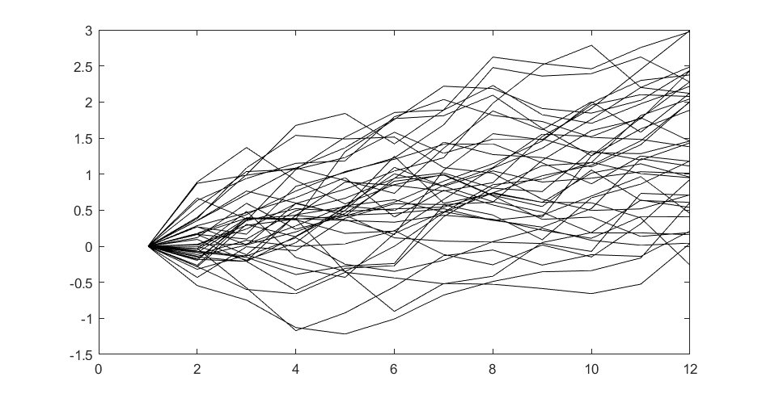
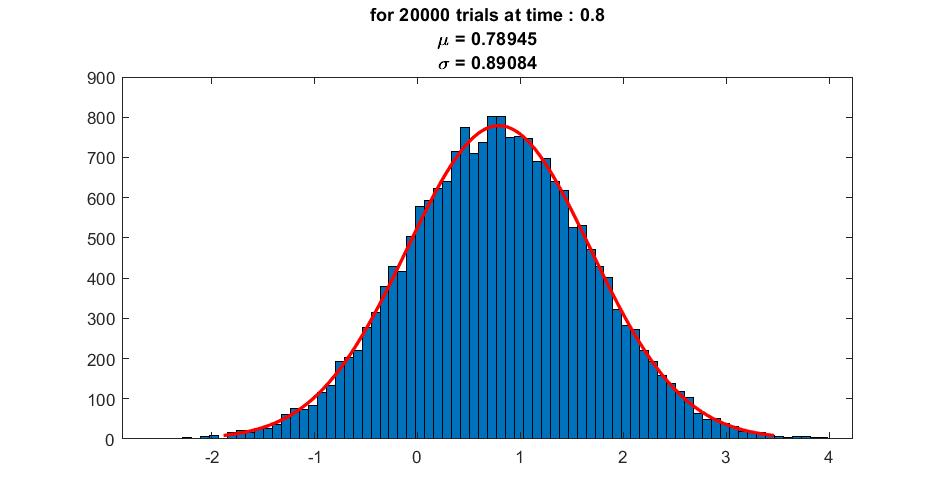
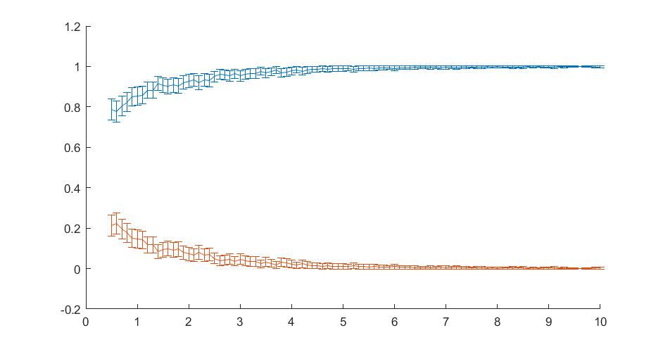
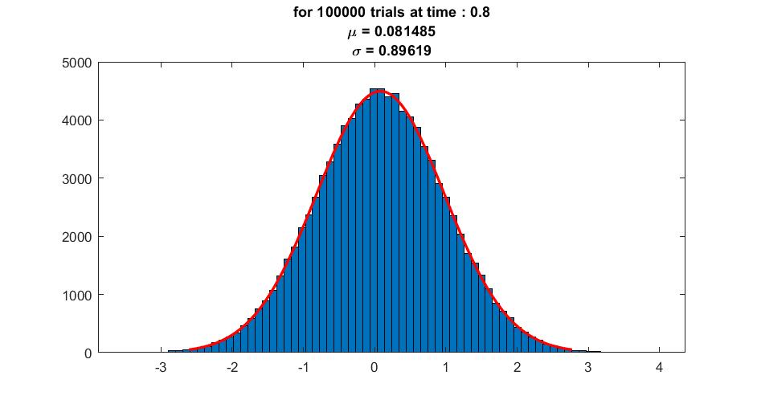
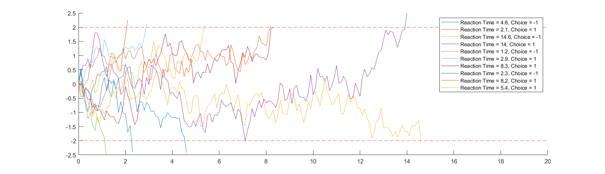
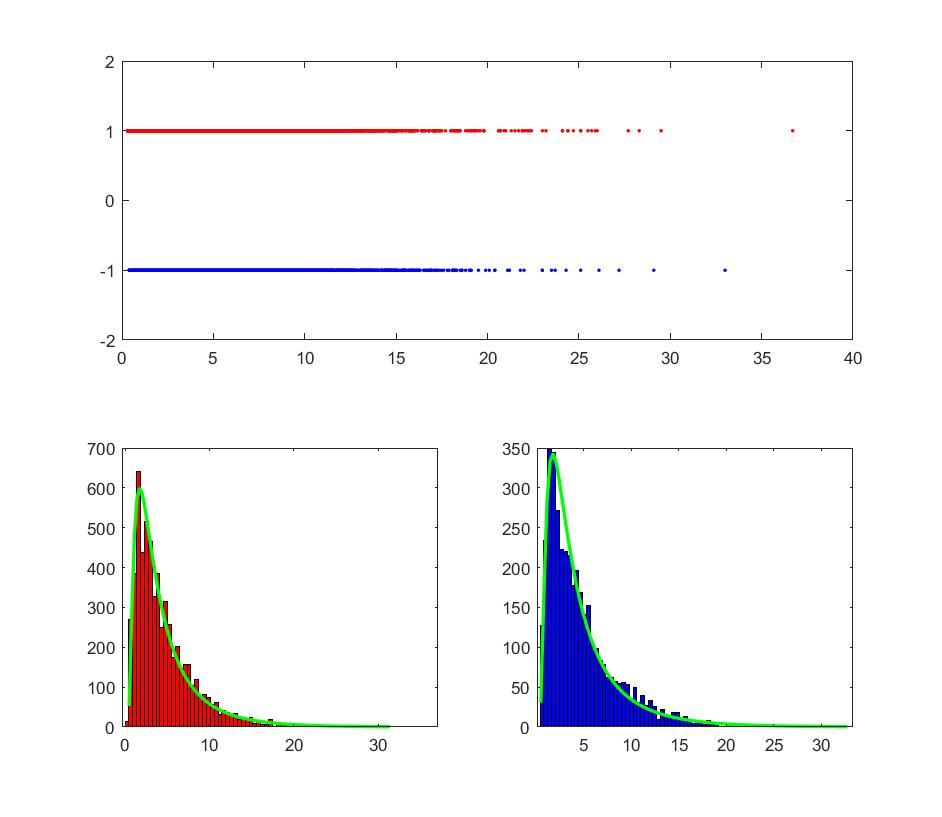
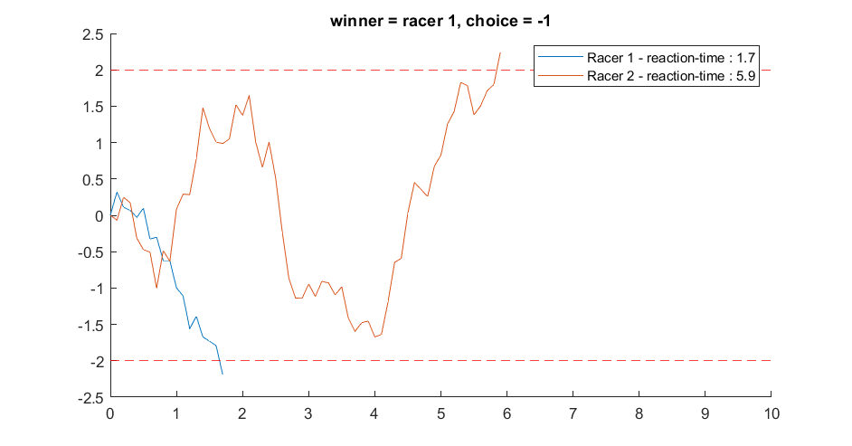
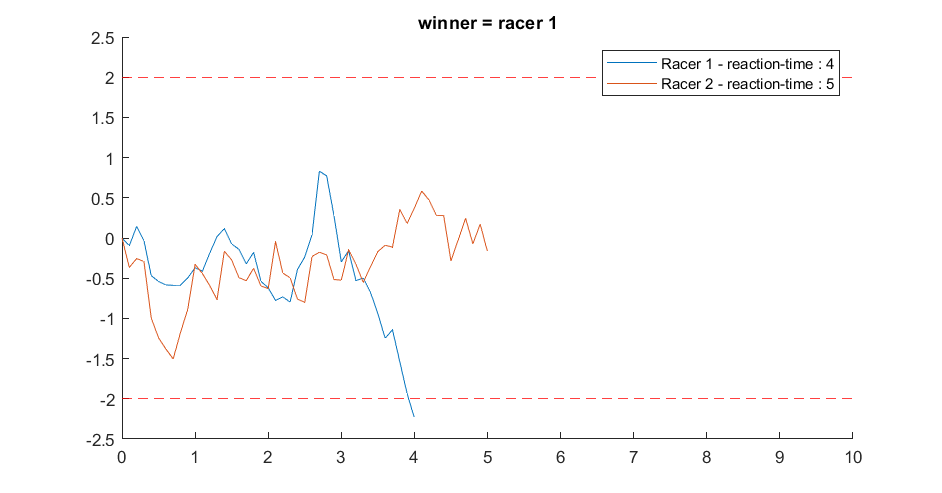
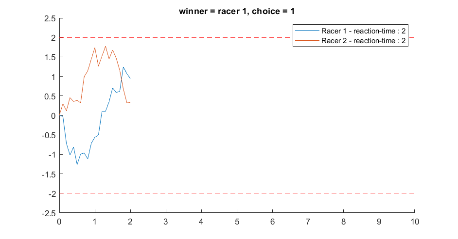

/

# Homework 7

## Part A

### Q1

<figure>
    
    <figcaption>Fig : </figcaption>
</figure>

### Q2

<figure>
    
    <figcaption>Fig : </figcaption>
</figure>

### Q3
<figure>
    
    <figcaption>Fig : </figcaption>
</figure>

<video controls autoplay width=80% >
    <source src="results/partA_Q3_errorbar_BiasDemo_sigma1_numTrials2000.mp4" type="video/mp4">
    [VIDEO] (Your browser does not support the video tag.)
</video>

<video controls autoplay width=80% >
    <source src="results/partA_Q3_errorbar_sigmaDemo_bias1_numTrials2000.mp4" type="video/mp4">
    [VIDEO] (Your browser does not support the video tag.)
</video>

### Q4
<figure>
    
    <figcaption>Fig : </figcaption>
</figure>

### Q5

<video controls autoplay width=80% >
    <source src="results/partA_Q5_errorbar_BiasDemo_sigma1_numTrials2000.mp4" type="video/mp4">
    [VIDEO] (Your browser does not support the video tag.)
</video>

<video controls autoplay width=80% >
    <source src="results/partA_Q5_errorbar_sigmaDemo_bias1_numTrials2000.mp4" type="video/mp4">
    [VIDEO] (Your browser does not support the video tag.)
</video>

##### Compare

<video controls autoplay width=100% >
    <source src="results/partA_compareQ3Q5_errorbar_biasDemo.mp4" type="video/mp4">
    [VIDEO] (Your browser does not support the video tag.)
</video>

<video controls autoplay width=100% >
    <source src="results/partA_compareQ3Q5_errorbar_sigmaDemo.mp4" type="video/mp4">
    [VIDEO] (Your browser does not support the video tag.)
</video>

### Q6

<figure>
    
    <figcaption>Fig : </figcaption>
</figure>

### Q7
<figure>
    
    <figcaption>Fig : </figcaption>
</figure>

### Q8

<figure>
    
    <figcaption>Fig : </figcaption>
</figure>

### Q9

<figure>
    
    <figcaption>Fig : </figcaption>
</figure>

<figure>
    
    <figcaption>Fig : </figcaption>
</figure>

